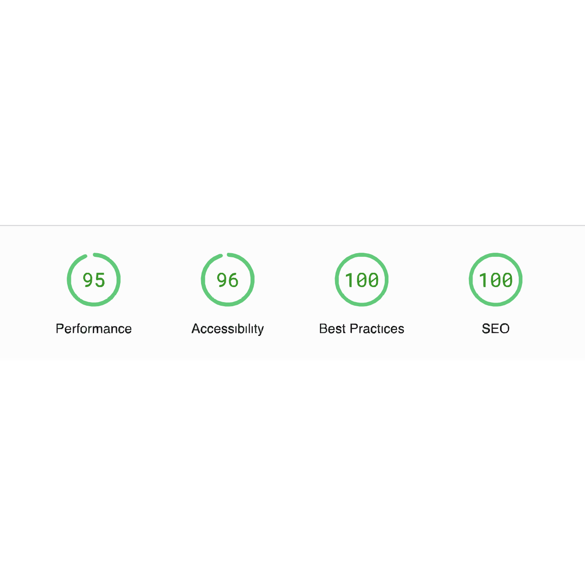

# Terry Anderson Portfolio


My portfolio website developed with Next.JS(SSG) and TypeScript. Tailwind CSS and GSAP is used for styling and animations. Light & Dark themes supported. Dark is first priotic.

## Features

- Responsive Design 📱💻
- Light & Dark themes ☀️🌙
- Fully Accessible ♿️
- SEO Friendly 🔎

## Tech Stack

**Frontend** - [NextJS](https://nextjs.org/), [React](https://reactjs.org/), [TypeScript](https://www.typescriptlang.org/)  
**Styling** - [Tailwind CSS](https://tailwindcss.com/)  
**Animations** - [GSAP](https://greenstock.com/)  
**Design & Prototype** - [Figma](https://figma.com/)  
**State Management** - [Zustand](https://zustand-demo.pmnd.rs/)  
**Deployment** - [Vercel](https://vercel.com/)

## Lighthouse Score

<a href="https://terry-anderson.vercel.app/">

<a>

## Running Locally

Clone the project

```bash
git clone https://github.com/VisionarySuperstar/CleanPortfolio.git
```

Go to the project directory

```bash
cd CleanPortfolio.git
```

Remove remote origin

```bash
git remote remove origin
```

Install dependencies

```bash
npm install
```

Start the server

```bash
npm run dev
```

## Inspiration and Credits

Here are some inspiration and credits for the design of my portfolio. However I can guarantee that I wrote 100% of the code. These credits are just for ideas and design for my portfolio website

- [Sat Naing Porfolio](https://satnaing.dev/)
- [Flowtrix](https://www.flowtrix.co/)

## Author
  
- [@terryanderson](https://terry-anderson.vercel.app/)
 
